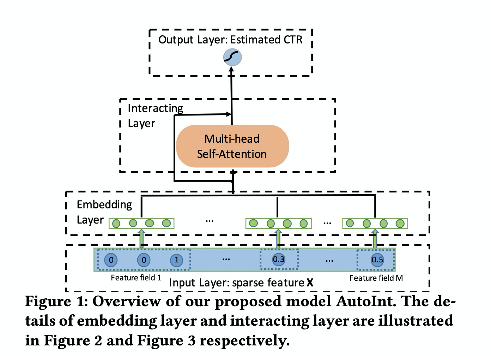

# AutoInt

### 简介

Automatic Feature Interaction Learning via Self-Attentive Neural Networks（AutoInt）通过将特征都映射到相同的低维空间中，然后利用带有残差连接的 Multi-head Self-Attention 机制显示构造高阶特征，对低维空间中的特征交互进行显式建模，有效提升了CTR预估的准确率。
注意：AutoInt 模型要求所有输入特征的 embedding\_dim 保持一致。



### 配置说明

```protobuf
model_config: {
  model_class: 'AutoInt'
  feature_groups: {
    group_name: 'all'
    feature_names: 'user_id'
    feature_names: 'cms_segid'
    feature_names: 'cms_group_id'
    feature_names: 'age_level'
    feature_names: 'pvalue_level'
    feature_names: 'shopping_level'
    feature_names: 'occupation'
    feature_names: 'new_user_class_level'
    feature_names: 'adgroup_id'
    feature_names: 'cate_id'
    feature_names: 'campaign_id'
    feature_names: 'customer'
    feature_names: 'brand'
    feature_names: 'price'
    feature_names: 'pid'
    feature_names: 'tag_category_list'
    feature_names: 'tag_brand_list'
    wide_deep: DEEP
  }
  autoint {
    multi_head_num: 2
    multi_head_size: 32
    interacting_layer_num: 3
    l2_regularization: 1e-6
  }
  embedding_regularization: 1e-4
}
```

- model\_class: 'AutoInt', 不需要修改

- feature\_groups: 配置一个名为'all'的feature\_group。

- autoint: autoint相关的参数

  - model\_dim: 与特征的embedding\_dim保持一致
  - multi\_head\_size: Multi-head Self-attention 中的 head size，默认为1
  - interacting\_layer\_num: 交叉层的层数，建议设在1到5之间，默认为1
  - l2\_regularization: L2正则，防止 overfit

- embedding\_regularization: 对embedding部分加regularization，防止overfit

### 示例Config

[AutoInt\_demo.config](https://easy-rec.oss-cn-hangzhou.aliyuncs.com/config/autoint.config)

### 参考论文

[AutoInt](https://dl.acm.org/doi/pdf/10.1145/3357384.3357925)
