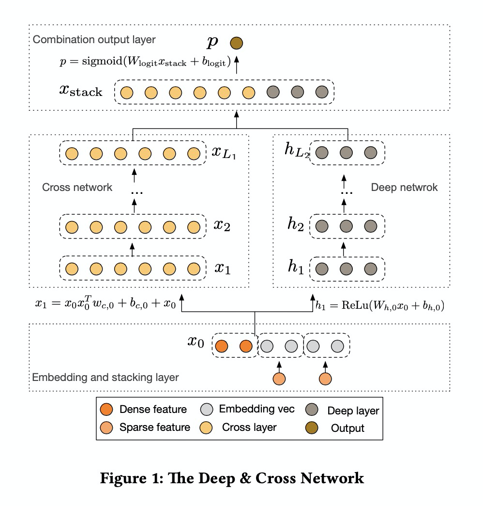

# DCN

### 简介

Deep＆Cross Network（DCN）是在DNN模型的基础上，引入了一种新型的交叉网络，该网络在学习某些特征交叉时效率更高。特别是，DCN显式地在每一层应用特征交叉，不需要人工特征工程，并且只增加了很小的额外复杂性。



### 配置说明

```protobuf
model_config: {
  model_class: 'DCN'
  feature_groups: {
    group_name: 'all'
    feature_names: 'user_id'
    feature_names: 'cms_segid'
    feature_names: 'cms_group_id'
    feature_names: 'age_level'
    feature_names: 'pvalue_level'
    feature_names: 'shopping_level'
    feature_names: 'occupation'
    feature_names: 'new_user_class_level'
    feature_names: 'adgroup_id'
    feature_names: 'cate_id'
    feature_names: 'campaign_id'
    feature_names: 'customer'
    feature_names: 'brand'
    feature_names: 'price'
    feature_names: 'pid'
    feature_names: 'tag_category_list'
    feature_names: 'tag_brand_list'
    wide_deep: DEEP
  }
  dcn {
    deep_tower {
      input: "all"
      dnn {
        hidden_units: [256, 128, 96, 64]
      }
    }
    cross_tower {
      input: "all"
      cross_num: 5
    }
    final_dnn {
      hidden_units: [128, 96, 64, 32, 16]
    }
    l2_regularization: 1e-6
  }
  embedding_regularization: 1e-4
}
```

- model\_class: 'DCN', 不需要修改

- feature\_groups: 配置一个名为'all'的feature\_group。

- dcn: dcn相关的参数

- deep\_tower

  - dnn: deep part的参数配置

    - hidden\_units: dnn每一层的channel数目，即神经元的数目

- cross\_tower

  - cross\_num: 交叉层层数，默认为3

- final\_dnn: 整合wide part, fm part, deep part的参数输入, 可以选择是否使用

  - hidden\_units: dnn每一层的channel数目，即神经元的数目

- embedding\_regularization: 对embedding部分加regularization，防止overfit

### 示例Config

[DCN\_demo.config](https://easy-rec.oss-cn-hangzhou.aliyuncs.com/config/dcn.config)

### 参考论文

[DCN](https://arxiv.org/abs/1708.05123)
