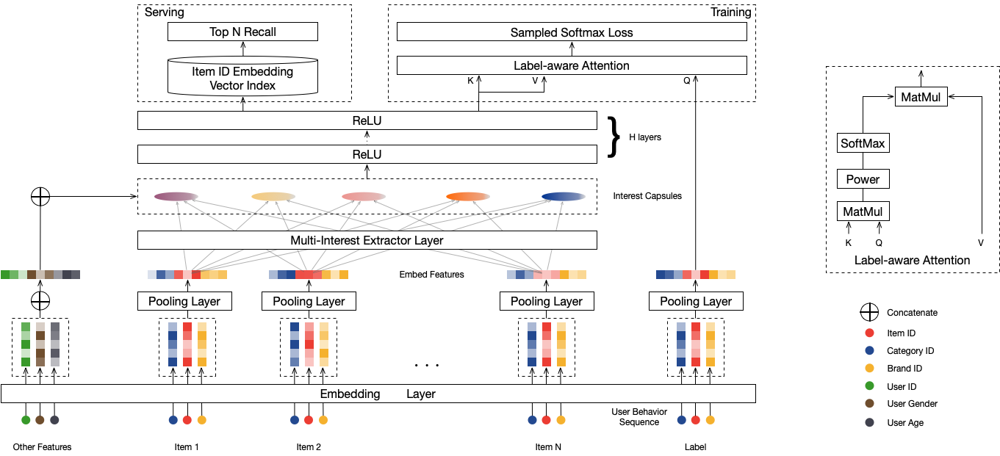

# MIND

### 简介

mind召回模型, 在dssm的基础上加入了兴趣聚类功能，支持多兴趣召回。


### 配置说明

```protobuf
model_config:{
  model_class: "MIND"
  feature_groups: {
    group_name: 'hist'
    feature_names: 'tag_category_list'
    feature_names: 'tag_brand_list'
    feature_naems: 'time_id'
  }
  feature_groups: {
    group_name: 'user'
    feature_names: 'user_id'
    feature_names: 'cms_segid'
    feature_names: 'cms_group_id'
    feature_names: 'age_level'
    feature_names: 'pvalue_level'
    feature_names: 'shopping_level'
    feature_names: 'occupation'
    feature_names: 'new_user_class_level'
    wide_deep:DEEP
  }
  feature_groups: {
    group_name: "item"
    feature_names: 'adgroup_id'
    feature_names: 'cate_id'
    feature_names: 'campaign_id'
    feature_names: 'customer'
    feature_names: 'brand'
    feature_names: 'price'
    feature_names: 'pid'
    wide_deep:DEEP
  }
  mind {
    user_dnn {
      hidden_units: [256, 128, 64, 32]
    }
    item_dnn {
      hidden_units: [256, 128, 64, 32]
    }

    capsule_config {
      max_k: 5
      max_seq_len: 64
      high_dim: 64
    }
    l2_regularization: 1e-6
  }
  embedding_regularization: 5e-5
}
```

- model_class: 'MIND', 不需要修改
- feature_groups: 需要三个feature_group: hist, user和item, **group name不能变**
- mind: mind相关的参数，必须配置user_dnn和item_dnn
- user_dnn/item_dnn:
  - dnn: deep part的参数配置
    - hidden_units: dnn每一层的channel数目，即神经元的数目
- pre_capsule_dnn: 进入capsule之前的dnn的配置, 可选，配置同user_dnn和item_dnn
- capsule_config: 胶囊(动态路由)的配置
  - max_k: 胶囊(兴趣)的个数
  - max_seq_len: hist seq的最大长度
  - high_dim: 兴趣向量的维度
  - num_iters: 动态路由(兴趣聚类)的轮数
  - routing_logits_scale: routing logits 放大的超参，为0时，不放大;
    - 一些场景显示设置为20时，兴趣向量的相似度比较低(0.8左右)
    - 设置为0时，容易导致兴趣向量趋于相同(相似度接近1)，覆盖的兴趣面变窄。
- simi_pow: label guided attention, 对相似度做的幂指数, 更倾向于选择和label相近的兴趣向量来计算loss
- embedding_regularization: 对embedding部分加regularization，防止overfit

### time_id, 注意特征的名字必须是time_id

- 行为序列特征可以加上time_id, time_id经过1 dimension的embedding后, 在time维度进行softmax, 然后和其它sequence feature的embedding相乘

- 具体的 time_id 的取值可参考:

  - 训练数据:  Math.round((2 * Math.log1p((labelTime - itemTime) / 60.) / Math.log(2.))) + 1;
  - inference: Math.round((2 * Math.log1p((currentTime - itemTime) / 60.) / Math.log(2.))) + 1;
  - 此处的时间(labelTime, itemTime, currentTime) 为秒, 这里给的只是一种取法, 供参考

### 调参经验

- 尽量使用全网的点击数据来生成训练样本，全网的行为会更加丰富，这有利于mind模型的训练。

- 刚开始训练的时候训练长一点，后面可以使用增量训练，增量训练的时候就可以训练短一点。

- 进行数据清洗，把那些行为太少的item直接在构造行为序列的时候就挖掉；也可以看看网站内是否有那些行为商品数巨量的(爬虫）用户。

- 根据自己的业务指标进行数据的重采样，因为mind模型的训练主要是以点击为目标的，如果业务指标是到交易，那么可以对产生交易的样本进行下重采样。

- 建议搞一个demo，看看mind整体召回和单个兴趣召回的结果，以便评估模型训练的好坏。

- 要看的指标是召回率，准确率和兴趣损失(interest loss，衡量生成的多个兴趣向量之前的差异度，interest loss越小，表示mind聚类效果越好)，三个指标要一起看。

- 建议基于itemid、cateid、timeid的简单序列特征训练模型取得一定成效后，再添加其他侧信息，以避免不必要的试错时间。

- 如果loss降不下来(一般loss要小于3), 并且是加了time_id，那建议多跑个100/200万步，如果还是没有明显下降，这时需要检查下训练数据。

### 示例Config

[MIND_demo.config](https://easyrec.oss-cn-beijing.aliyuncs.com/config/mind.config)

### 效果评估

[效果评估](https://easyrec.oss-cn-beijing.aliyuncs.com/docs/recall_eval.pdf)

### 参考论文

[MIND.pdf](https://arxiv.org/pdf/1904.08030.pdf)
