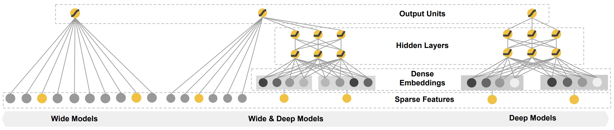

# WideAndDeep

### 简介

WideAndDeep包含Wide和Deep两部分，Wide部分负责记忆，Deep部分负责泛化。Wide部分可以做显式的特征交叉，Deep部分可以实现隐式自动的特征交叉。



### 配置说明

```protobuf
model_config:{
  model_class: "WideAndDeep"
  feature_groups: {
    group_name: "deep"
    feature_names: "hour"
    feature_names: "c1"
    ...
    feature_names: "site_id_app_id"
    wide_deep:DEEP
  }
  feature_groups: {
    group_name: "wide"
    feature_names: "hour"
    feature_names: "c1"
    ...
    feature_names: "c21"
    wide_deep:WIDE
  }

  wide_and_deep {
    wide_output_dim: 16

    dnn {
      hidden_units: [128, 64, 32]
    }

    final_dnn {
      hidden_units: [128, 64]
    }
    l2_regularization: 1e-5
  }
  embedding_regularization: 1e-7
}
```

- model\_class: 'WideAndDeep', 不需要修改

- feature\_groups:

  需要两个feature\_group: wide group和deep group, **group name不能变**

- wide\_and\_deep:  wide\_and\_deep 相关的参数

- dnn: deep part的参数配置

  - hidden\_units: dnn每一层的channel数目，即神经元的数目

- wide\_output\_dim: wide部分输出的大小

- final\_dnn: 整合wide part, deep part的参数输入, 可以选择是否使用

  - hidden\_units: dnn每一层的channel数目，即神经元的数目

- embedding\_regularization: 对embedding部分加regularization，防止overfit

- input\_type: 如果在提交到pai-tf集群上面运行，读取max compute 表作为输入数据，data\_config：input\_type要设置为OdpsInputV2。

### 示例Config

[WideAndDeep\_demo.config](https://easy-rec.oss-cn-hangzhou.aliyuncs.com/config/wide_and_deep.config)

### 参考论文

[WideAndDeep](https://arxiv.org/abs/1606.07792)
